# TBA - Hollow Knight

Ce repo contient une version du jeu d’aventure TBA reprenant les idées du jeu **Hollow Knight**.

## Description de l'univers

 Le jeu se déroule dans le royaume souterrain d'Hallownest. Vous pourrez vous aventurer dans 12 lieux souterrains différents :
 - Falaises hurlantes
 - Dirtmouth
 - Mont Cristal
 - Vertchemin
 - Routes oubliées
 - Temple de l'oeuf noir
 - Lac Bleu
 - Brumes Canyon
 - Caverne nocive
 - Cité des Larmes
 - Village des Mantes 
 - Nid profond

 Le joueur incarne **Quirrel**, un voyageur amnésique explorant le royaume d'**Hallownest**. Le joueur progresse en explorant les lieux tels que des cavernes obscures, des ruines remplies d'ennemis, des temples scellés par des forces anciennes. 

## Structuration

Il y a 8 modules contenant chacun une classe et 1 module contenant deux classes.

- `game.py` / `Game` : description de l'environnement, interface avec le joueur ;
- `room.py` / `Room` : propriétés génériques d'un lieu  ;
- `player.py` / `Player` : le joueur ;
- `command.py` / `Command` : les consignes données par le joueur ;
- `actions.py` / `Action` : les interactions entre ;
- `item.py` / `Item` : la gestion des objets ;
- `character.py` / `Character` : les PNJ pacifiques et hostiles ;
- `door.py` / `Door` : accès à certaines portes sous condition ;
- `quest.py` / `Quest`,`QuestManager` : les quêtes à accomplir et les récompenses obtenues.

## Objectif du jeu

L'objectif final du jeu est de vaincre le **Hollow Knight** afin de déterminer le destin du royaume.
Pour y parvenir, Quirrel doit faire attention autour de lui et doit :
- explorer les différentes régions ;
- accomplir toutes les quêtes ;
- avant de débloquer l'accès au **Temple de l'oeuf Noir** pour sauver le royaume d'Hallownest.

## Condition de victoire et de défaite

- Le joueur **gagne** lorsque le **Hollow Knight** est vaincu au **Temple de l'oeuf Noir**.
L'accès au Temple de l'oeuf Noir, là où se trouve le boss final, est bloqué tant que toutes les quêtes ne sont pas complétées.

- Le joueur **perd** s'il engage un combat contre un ennemi hostile dont le niveau est strictement supérieur à celui de Quirrel. 
La mort met fin à la partie.

## Déplacement et exploration
Quirrel se situe dans les sous-terrains profonds d'Hallownest. Pour explorer les différents lieux du royaume, vous pouvez vous déplacer selon quatre directions : Haut Bas Ouest Est (Up, Down, O, E).

Certaines zones :
- nécessitent des objets spécifiques (les portes sont verrouillées sans ces objets).
- sont inaccessibles tant que certaines quêtes ne sont pas terminées. 
- peuvent être plongées dans l’obscurité. (Vous ne pourrez alors pas apercevoir l'inventaire de la pièce sans l'item spécifique : la lanterne)

## Système de quêtes

Le jeu intègre un système de quêtes composé de :
- quête d'items : récupérer un objet spécifique dans une pièce donnée ;
- quête de déplacement : visiter une pièce spécifique ;
- quête de combat : vaincre un PNJ spécifique ;
- quête d’interaction : interagir avec un PNJ spécifique.

L'accomplissement de toutes les quêtes est indispensable pour accéder au boss final situé à Temple de l'oeuf Noir et terminer le jeu.

## Commandes disponibles

- `help` : Affiche la liste des commandes;
- `go` direction : se déplacer dans une direction cardinale;
- `history` : afficher l'historique des pièces visitées;
- `back` : revenir dans la salle précédente;
- `look` : regarder les items présents dans la salle;
- `take` item : prendre un objet;
- `drop` item : déposer un objet;
- `check` : vérifier l'inventaire du joueur;
- `talk` ou `talk` pnj : parler à un PNJ;
- `fight` : combattre un ennemi;
- `quests` : afficher la liste des quêtes;
- `quest` titre : afficher les détails de la quête;
- `activate` titre : activer une quête;
- `rewards` : afficher les récompenses obtenues;
- `sell` ou `sell` item : vendre un objet;
- `buy` ou `buy` item : acheter un objet;
- `train` : s'entrainer auprès d'un maître;
- `upgrade` : améliorer une arme auprès d'un forgeron;
- `quit` : quitter le jeu.

## Diagrammes de classes
Voici la structure des classes

```mermaid
classDiagram
    class Game {
        +finished : bool
        +rooms : list[Room]
        +commands : dict[str, Command]
        +characters : list[Character]
        +player : Player
        +items : dict[str, Item]

        +__init__()
        +setup()
        +_setup_quests()
        +unlock_temple_black_egg() : bool
        +play()
        +process_command(command_string : str)
        +print_welcome()
        +get_characters_in_room() : list[Character]
        +win() : bool
        +loose() : bool
        +move_zote_randomly()
    }

    class Room {
        +name : str
        +description : str
        +exits : dict[str, Room|Door|None]
        +inventory : dict[str, Item]
        +characters : dict
        +dark : bool

        +__init__ -> None
        +get_exit(direction : str)
        +get_exit_string() : str
        +get_long_description() : str
        +get_inventory() : str
        +get_characters(characters : list[Character]) : str
    }

    class Player {
        +name : str
        +current_room : Room
        +history : list[Room]
        +inventory : dict[str, Item]
        +geos : int
        +level : int
        +alive : bool
        +move_count : int
        +quest_manager : QuestManager
        +rewards : list[str]
        +history_limit : int

        +__init__(name : str)
        +move(direction : str) : bool
        +add_reward(reward : str)
        +show_rewards()
        +get_history()
        +get_inventory() : str
        +has_item(item_name : str) : bool
        +die()
        +get_minerai_pale()
        +remove_item(item_name : str) : bool
        +add_item(item : Item)
        +level_status() : str
    }

    class Command {
        +command_word : str
        +help_string : str
        +action : callable
        +number_of_parameters : int
        +consumes_turn : bool

        +__init__(command_word : str, help_string : str, action, number_of_parameters : int, consumes_turn : bool)
        +__str__() : str
    }

    class Actions {
            +go(game : Game, list_of_words : list[str], number_of_parameters : int) : bool
            +quit(game : Game, list_of_words : list[str], number_of_parameters : int) : bool
            +history(game : Game, list_of_words : list[str], number_of_parameters : int) : bool
            +look(game : Game, list_of_words : list[str], number_of_parameters : int) : bool
            +take(game : Game, list_of_words : list[str], number_of_parameters : int) : bool
            +drop(game : Game, list_of_words : list[str], number_of_parameters : int) : bool
            +check(game : Game, list_of_words : list[str], number_of_parameters : int) : bool
            +back(game : Game, list_of_words : list[str], number_of_parameters : int) : bool
            +help(game : Game, list_of_words : list[str], number_of_parameters : int) : bool
            +talk(game : Game, list_of_words : list[str], number_of_parameters : int) : bool
            +fight(game : Game, list_of_words : list[str], number_of_parameters : int) : bool
            +resolve_fight(player : Player, enemy : Character)
            +quests(game : Game, list_of_words : list[str], number_of_parameters : int) : bool
            +quest(game : Game, list_of_words : list[str], number_of_parameters : int) : bool
            +activate(game : Game, list_of_words : list[str], number_of_parameters : int) : bool
            +rewards(game : Game, list_of_words : list[str], number_of_parameters : int) : bool
            +sell(game : Game, list_of_words : list[str], number_of_parameters : int) : bool
            +buy(game : Game, list_of_words : list[str], number_of_parameters : int) : bool
            +train(game : Game, list_of_words : list[str], number_of_parameters : int) : bool
            +upgrade(game : Game, list_of_words : list[str], number_of_parameters : int) : bool
    }

    class Item {
            +name : str
            +description : str
            +value : int

            +__init__(name : str, description : str, value : int)
            +__str__() : str
    }

    class Door {
        +destination : Room
        +locked : bool
        +key : str

        +__init__(destination : Room, locked : bool, key : str)
    }

    class Character {
        +name : str
        +description : str
        +current_room : Room
        +msgs : list[str]
        +level : int
        +hostile : bool
        +is_boss : bool
        +defeated : bool
        +merchant : bool
        +stock : dict[str, Item]
        +trainer : bool
        +training_cost : int
        +reward_geos : int
        +blacksmith : bool
        +upgrade_cost : int

        +__init__(name : str, description : str, current_room : Room, msgs : list[str])
        +__str__() : str
        +move_between(room_a : Room, room_b : Room)
        +get_msg() : str
    }

    class Quest {
        +title : str
        +description : str
        +objectives : list[str]
        +completed_objectives : list[str]
        +is_completed : bool
        +is_active : bool
        +reward : str

        +__init__(title : str, description : str, objectives : list[str], reward : str)
        +activate()
        +complete_objective(objective : str, player : Player) : bool
        +complete_quest(player : Player)
        +get_status() : str
        +get_details(current_counts : dict) : str
        +check_room_objective(room_name : str, player : Player) : bool
        +check_action_objective(action : str, target : str, player : Player) : bool
        +check_counter_objective(counter_name : str, current_count : int, player : Player) : bool
        +__str__() : str
    }

    class QuestManager {
        +quests : list[Quest]
        +active_quests : list[Quest]
        +player : Player

        +__init__(player : Player)
        +add_quest(quest : Quest)
        +activate_quest(title : str) : bool
        +complete_objective(objective : str) : bool
        +check_room_objectives(room_name : str)
        +check_action_objectives(action : str, target : str)
        +check_counter_objectives(counter_name : str, current_count : int)
        +get_active_quests() : list[Quest]
        +get_all_quests() : list[Quest]
        +get_quest_by_title(title : str)
        +show_quests()
        +show_quest_details(title : str, current_counts : dict)
    }
```

## Perspectives de développement
- Ajouter un inventaire dans l'inventaire. Parmi nos items, il y avait des reliques tels que le journal du vagabond, le sceau d'hallownest, l'idole du roi et l'oeuf arcanique. Il serait interessant d'ajouter une mallette dans l'inventaire et d'ajouter une condition `relique=True` pour que les reliques soient placées dans la mallette.
- Faire en sorte que certains PNJ hostile deviennent non hostiles apres les avoir combattus. A l'inverse, faire en sorte que des PNJ non hostile le deviennent après certains événements.
- Ajouter de la stratégie au système de combat (attack/defense).
- Ajouter des dialogues interactives, où l'on peut choisir sa réponse ou bien ses questions.

